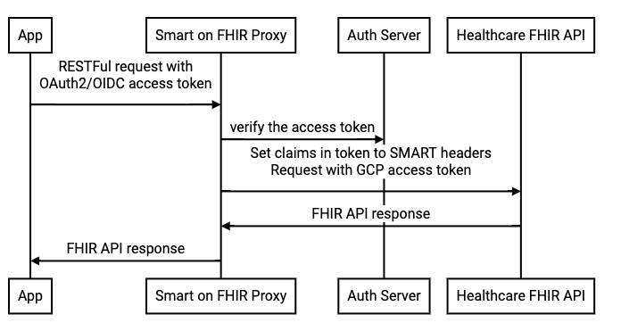

# SMART on FHIR

## SMARTproxy

**IMPORTANT: This service is experimental and is not to be used with production
systems nor production data. For testing purposes only with synthetic or public
data.**

### Overview

SMARTproxy delivers a means to have the Google Healthcare FHIR API accept and
validate SMARTonFHIR access tokens as a separate processing layer, allowing the
core FHIR API extend to include SMART access tokens as part of its identity
management and permission model.

See the [SMARTonFHIR specification](http://www.hl7.org/fhir/smart-app-launch/)
for more details on SMART-compliant access tokens.

#### Architecture


### Configuration

SMARTproxy offers the following configuration parameters:

- `FHIR_ISSUER`: the "iss" claim expected in the SMARTonFHIR token.
- `PROXY_TO`: the FHIR service root URL.
- `SERVICE_ACCOUNT_NAME`: the service account name for the proxy to use when
  calling the FHIR (PROXY_TO) endpoints. Default is "fhirproxy".
- `ALLOWED_PATH_PREFIX`: a comma-delimited set of Healthcare API paths to proxy.
  This provides the ability to limit which projects, datasets etc. with which
  the proxy may be used. Each entry must start with "/".
- `AUDIENCE`: a string that represents the expected audience for the access
  token. It may be set to the same string as the Token Issuer's client ID
  depending on how the Token Issuer populates the claim.
- `FHIR_ISSUER_CLIENT_ID`: the Relying Party client ID for the proxy as allocated by the
  token issuer IDP. This may be used when the proxy calls OIDC endpoints.
- `FHIR_ISSUER_CLIENT_SECRET`: the Relying Party client secret for the proxy as allocated
  by the token issuer IDP. This may be used when the proxy calls OIDC endpoints.
- `CLIENTS_OF_PROXY`: a set of key/value pairs of client applications that are
  able to access the proxy. When non-empty, all clients of this proxy must pass
  in `X-Client-ID` and `X-Client-Secret` headers with their requests and match
  one of the entries on this list, or else the request will be unauthorized.
- `REMOVE_SCOPES`: a comma-delimited set of scopes to remove from the
  `X-Authorization-Scope` header that the proxy includes in its requests to
  downstream servers.

#### Reduce audit log

If you want to reduce audit logs from Federated Access auth library, set the
following environment variable before the service start:

```
export DISABLE_AUDIT_LOG=true
```

Note: default request / processing logs may still be available even when audit
logs are disabled, however the supplemental SMART context and identity audit
information will not be added to the default logs.

### Deployment

#### GAE Flex Deployment

For the deployment setup, you will need to create a GCP project then run the
following to enable needed APIs, create service accounts and grant permission to
service accounts:
```
scripts/prepare_project_gae.bash -p ${PROJECT?}
```

This script with change enable the following required APIs:

- `iam`: for use to create short-live access token to acess FHIR API
- `containerregistry`: to store smart on FHIR proxy docker image
- `appengineflex`: GAE Flex will host the SMART-on-FHIR proxy

It will also set the following permissions:

- the GAE Service Account (SA) needs `serviceAccountTokenCreator` permissions to
  create short-live access tokens
- the `fhiruser` SA, which will be used by the proxy to make calls into the
  FHIR store, needs `healthcare.datasetViewer`, `healthcare.datasetAdmin`,
  `healthcare.fhirStoreAdmin` and `healthcare.fhirResourceEditor` to access FHIR
  API

Once the `prepare_project` script completes, you will need to deploy the proxy
service in your project. It will need to make use of an OIDC server that mints
an access token that contains a specific `aud` claim to indicate that this proxy
is the relying party. Once you have determined your `OIDC_ISSUER` URL (i.e. the
`iss` claim value) and `aud` it will use for the proxy, run the following:

```
proxy/deploy/gae-flex/deploy.bash -p ${PROJECT?} -o ${OIDC_ISSUER?} -a ${AUD?}
```

### GKE Deployment

Similarly to GAE deployment, we have `prepare_project` and `deploy` scripts for
GKE.

```
scripts/prepare_project_gke.bash -p ${PROJECT?}

proxy/deploy/gke/deploy.bash -p ${PROJECT?} -o ${OIDC_ISSUER?} -a ${AUD?}
```


### Manual Proxy Test

Prepare your test FHIR store with some simple data:

1. [Create a FHIR store](https://cloud.google.com/healthcare/docs/how-tos/fhir#creating_a_fhir_store)
   named `smart-on-fhir` under a dataset named `test`. Set environment variables
   for use in future steps:
   ```
   PROJECT=<your-project-id>
   LOCATION=us-central1
   DATASET=test
   FHIR_STORE_ID=smart-on-fhir
   ```
1. Fetch basic dataset information via the proxy to see if project or service
   settings in general cause any errors:
   ```
   curl "https://${PROJECT?}.uc.r.appspot.com/v1/projects/${PROJECT?}/locations/${LOCATION?}/datasets/${DATASET?}" -H "Authorization: Bearer ${TOKEN?}
   ```

   Resolve any errors before moving on to the next steps.
1. [Create a FHIR resource](https://cloud.google.com/healthcare/docs/how-tos/fhir-resources#creating_a_fhir_resource) using Curl. Take note of the `id` returned
   in the response. Set `PATIENT_ID` to this `id` for use in future steps.
1. Allocate a test account SMART-on-FHIR token from your OIDC issuer. Make sure
   it has the `patient/*.read` scope or `patient/${PATIENT_ID?}.read` scope.
1. Fetch the patient record like this:
   ```
   curl "https://${PROJECT?}.uc.r.appspot.com/v1/projects/${PROJECT?}/locations/${LOCATION?}/datasets/${DATASET?}/fhirStores/${FHIR_STORE_ID?}/fhir/Patient/${PATIENT_ID?}" -H "Authorization: Bearer ${TOKEN?}
   ```

### Optional feature

#### Use cache to improve opaque access token validation performance

Validating opaque access token is heavy because it need to call a remote endpoint. We may use cache to improve it by storing the sha256 hash of access token as key and the result of the remote validation endpoint with min(token expiry, 10 minute) TTL.

To enable this feature:

- Grant iam role `roles/redis.editor` to Service account `fhiruser`:
```
gcloud projects add-iam-policy-binding --member serviceAccount:fhiruser@${PROJECT?}.iam.gserviceaccount.com --role roles/redis.editor
```
- Enable by setting env var: `export CACHE_ADDR=${REDIS_IP?}:${REDIS_PORT?}`
- Also enable verify access token via userinfo endpoint by setting env var: `export USE_USERINFO_TO_VERIFY_ACCESSTOKEN=true`

If you are using terraform script to deploy, change `use_userinfo_to_verify_accesstoken` and `enable_cache` to true in the head of `deployment.hcl`.

#### Use secret manager to store secrets

Smart on FHIR proxy requires secrets pass to env var:

- `FHIR_ISSUER_CLIENT_SECRET`: client secret used to call OIDC issuer
- `CLIENTS_OF_PROXY`: client secret app used tp call proxy

The proxy supports using [GCP secretmanager](https://cloud.google.com/secret-manager) to store these secrets. To enable this feature:

- Grant iam role `roles/secretmanager.viewer` to Service account `fhiruser`:
```
gcloud projects add-iam-policy-binding --member serviceAccount:fhiruser@${PROJECT?}.iam.gserviceaccount.com --role roles/secretmanager.viewer
```
- Enable by setting env var: `export USE_SECRET_MANAGER=true`
- Use the key of secret instead of the secret in `FHIR_ISSUER_CLIENT_SECRET` and `CLIENTS_OF_PROXY`
- Store secret in secretmanager before start the service, example:
```
gcloud secrets create ${MY_SECRET_KEY?} --replication-policy=automatic
gcloud secrets versions add ${MY_SECRET_KEY?} --data-file="/path/to/file.txt"
```

If you are using terraform script to deploy, change `use_secret_manager` to true in the head of `deployment.hcl`.

### Code Testing Procedure

#### unit tests

```
./run_tests.bash
```

#### e2e tests

To run e2e tests, you will need to:

1. Deploy the proxy, see the [deployment](#deployment) section above.
1. Deploy an OIDC server, and use the [persona token](https://github.com/GoogleCloudPlatform/healthcare-federated-access-services/blob/a2aa697f64c7920fc212c420c3562ec17b31a804/lib/testkeys/testkeys.go#L59) as the RSA key. You may use the [persona server](https://github.com/GoogleCloudPlatform/healthcare-federated-access-services/blob/master/gcp/personas/main.go) for testing.
1. The proxy is able to receive requests from the test runner.
1. Test runner requires roles:

```
gcloud projects add-iam-policy-binding -q ${PROJECT?} \
  --member serviceAccount:testuser@${PROJECT?}.iam.gserviceaccount.com --role roles/healthcare.datasetAdmin
gcloud projects add-iam-policy-binding -q ${PROJECT?} \
  --member serviceAccount:testuser@${PROJECT?}.iam.gserviceaccount.com --role roles/healthcare.fhirStoreAdmin
gcloud projects add-iam-policy-binding -q ${PROJECT?} \
  --member serviceAccount:testuser@${PROJECT?}.iam.gserviceaccount.com --role roles/healthcare.fhirResourceEditor
```

If you are using terraform script to deploy, change `setup_e2e_test_project` to true in the head of `deployment.hcl`.

Then you can run the tests:

```
go test ./proxy/integration_test -e2etest=true -iss=${YOUR_TEST_OIDC_ISSUER_URL?} -proxy=${YOUR_PROXY_URL?} -project=${YOUR_TEST_PROJECT?} -aud=${AUD_ACCEPTED_IN_PROXY?}
```
